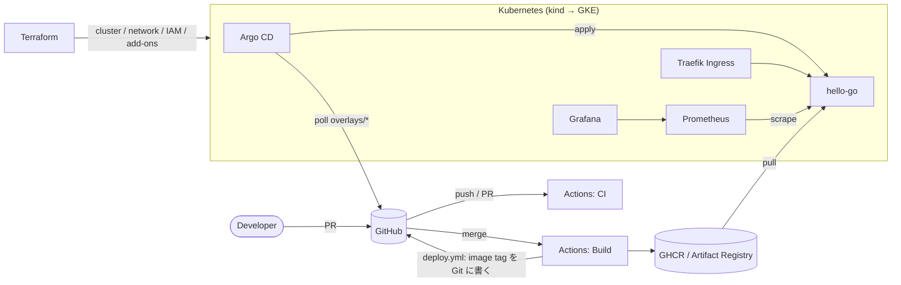

# My Cloud Platform

**変更して、デプロイして、観察して、壊して、調べて、直す。** ── そのサイクルを何度でも回せる、実践型クラウドエンジニア訓練環境。

[](https://github.com/masashi-xiaoliu/my-cloud-platform/actions/workflows/ci.yml)

```text
変更 → 予想 → PR → CI → Merge → CD(Argo CD) → Infrastructure / Application の変化 → Metrics の変化
   → 問題発生 → Troubleshooting → 修正 → 再デプロイ → 復旧 → 記録 → 改善 → (次の変更へ)
```

> ### 🧭 次に何をすればいい？
>
> | いまの状態 | 次にやること |
> |---|---|
> | まだ何も触っていない | [7. Getting Started](#7-getting-started) → [Phase 0](docs/phases/phase-00-setup.md) |
> | Phase を進めている | [8. Learning Roadmap](#8-learning-roadmap) の表で次の Phase を開く |
> | 設定値を変えて試したい | [16. Tuning Lab](#16-tuning-lab) の表から 1 つ選ぶ → [Standard Change Loop](docs/labs/README.md#standard-change-loop) |
> | 障害対応の練習をしたい | `make chaos` → [18. Incident Response Lab](#18-incident-response-lab) |
> | 何かが壊れて困っている | `make status` → [20. Troubleshooting Guide](#20-troubleshooting-guide) |
> | 元に戻したい | `make reset` → commit → PR → Merge |

---

## 1. What is this?

Go 製の極小 Web API（`Hello from My Cloud Platform`）を題材に、**Docker → Kubernetes → GitHub Actions → Argo CD → Terraform → GCP → Monitoring → Failure/Recovery → Reusable Platform** と段階的に育てていくリポジトリです。

アプリは意図的に単純です。その代わりに：

- **設定値を変えると挙動が変わるノブ** を大量に用意しています（replicas、requests/limits、HPA、ConfigMap、Secret、タイムアウト、リトライ、エラー率、遅延、メモリ消費、Probe、Service port、Ingress…）。リポジトリ内では `★ LAB Txx` コメントで場所を示しています
- 各課題は **① 変更する場所 → ② 変更する値 → ③ 予想 → ④ 実行方法 → ⑤ 確認場所と成功条件 → ⑥ 失敗時の調査 → ⑦ 復旧** の 7 ステップで統一しています
- **障害を意図的に起こす仕組み**（`scripts/chaos.py`）があり、何が壊れたかわからない状態から調査する「ブラインド訓練」ができます
- 答えは `<details>` に折りたたみ、**Hint → 調査 → 仮説 → Answer** の順で進めます
- すべての実験は `docs/experiments/` に **予想と結果の差** として記録します

## 2. Why I built this

目指すのは「アプリケーションを一度デプロイできる人」ではなく、**共通のプラットフォームを設計・構築し、その上に様々なアプリを載せ、変更・デプロイ・監視・障害対応・復旧まで行えるエンジニア** です。

そのために、このプロジェクトでは **使用技術の数より「触った回数・変更した回数・壊した回数・復旧した回数」** を重視します（[docs/learning-log.md](docs/learning-log.md) で数えます）。

| 技術 | 繰り返すサイクル |
|---|---|
| Kubernetes | Pod を作る → 増やす → 消す → 壊す → 調べる → 直す |
| Terraform | plan → apply → 変更 → plan → apply → destroy → 再構築 |
| CI/CD | 成功 → 失敗 → ログ確認 → 修正 → 成功 |
| 監視 | 設定変更 → システム変化 → メトリクス変化 → アラート → 復旧 |

ポートフォリオとしての見どころは [docs/portfolio.md](docs/portfolio.md) にまとめています。

## 3. Relationship to Web / WordPress Business

私は現在、WordPress を中心とした Web 制作・運用の会社で仕事をしています。このリポジトリは **WordPress を Kubernetes に載せるためのものではありません。** 今後の Web 制作・運用案件で、**品質・開発効率・保守性・自動化の選択肢を増やすための技術キャッチアップ** です。

| 技術 | Web 制作・運用への応用 | 例 |
|---|---|---|
| Docker | 開発環境の標準化 | 「自分の PC では動く」をなくす。新メンバーが初日から同じ環境で作業できる |
| Git / Pull Request | 変更履歴・レビュー・共同開発 | テーマやプラグインの変更を、誰がいつ何のために行ったか追跡できる |
| CI | 自動テスト・品質チェック | PHP 構文チェック、コーディング規約、リンク切れ、画像サイズのチェックを PR ごとに自動実行 |
| CD | デプロイ自動化 | FTP の手作業アップロードをやめ、承認された変更だけを決まった手順で反映 |
| Rollback | 安全な更新 | 更新で不具合が出ても、直前の状態に数分で戻せる |
| Terraform | インフラ構築のコード化 | サーバー・DNS・バックアップ設定の再現性。担当者が変わっても構成がわかる |
| Monitoring | 運用品質の向上 | 「お客様から連絡が来て初めて障害に気付く」をなくす。応答時間・エラー率の可視化 |
| Security | 安全な Web 運用 | 秘密情報をコードに書かない、最小権限、更新の自動チェック |
| Cloud | 案件規模に応じたインフラ選択 | 共用サーバー / VPS / クラウドを、予算・アクセス規模・運用体制から選べる |
| Kubernetes | 大規模・複雑な案件での選択肢 | 高トラフィック、複数サービス、API 連携が多い案件など **必要な場合に限って** |

**すべての WordPress 案件に Kubernetes を導入する、という主張ではありません。** 多くの案件ではマネージド WordPress や VPS が最適です。案件規模・予算・保守性・運用負荷を考慮し、**必要な案件に必要な技術を適用できるよう、技術的な選択肢を増やす** ことが目的です。実際、ここで身につく「Git での変更管理」「CI による自動チェック」「手順化されたデプロイと Rollback」「監視」は、Kubernetes を使わない通常の WordPress 運用にもそのまま持ち込めます。

## 4. Architecture



| 誰が | 何を適用するか | 頻度 |
|---|---|---|
| 人（`terraform plan/apply`） | クラスタ・ネットワーク・IAM・アドオン（Traefik / Argo CD / Prometheus） | 低 |
| Argo CD（Git から自動） | アプリのワークロード（Deployment / Service / Ingress / ConfigMap / HPA …） | 高 |
| GitHub Actions | イメージのビルドと、image tag の Git への書き込み | 高 |

詳細（リクエストの流れ・環境・セキュリティ既定値）は [docs/architecture.md](docs/architecture.md)。

### ディレクトリ構成

```text
my-cloud-platform/
├── README.md
├── Makefile                      よく使う操作のショートカット（make help）
├── docker-compose.yml            Phase 2: Kubernetes なしで起動
├── apps/                         ── 20%: アプリケーション ──
│   ├── hello-go/                 main.go / metrics.go / main_test.go / Dockerfile
│   ├── fastapi/                  Phase 10: 同じ基盤に載せる 2 つ目のアプリ
│   └── laravel/                  Phase 10 発展: 検討メモ
├── docker/base/                  Dockerfile の共通ルール
├── kubernetes/                   ── 80%: ワークロードの型 ──
│   ├── base/                     deployment / service / ingress / config.env
│   ├── components/               ON/OFF できる部品: hpa / monitoring / pdb / network-policy / postgres
│   ├── overlays/                 環境差分: local / dev / staging / prod
│   │   └── dev/                  kustomization.yaml / patch-deployment.yaml / config.env / secret.env ★よく触る
│   └── jobs/                     負荷生成 Job / 外形監視 CronJob
├── argocd/
│   ├── bootstrap/root.yaml       App of Apps（これだけ手で apply）
│   ├── projects/                 AppProject（ガードレール）
│   └── applications/             hello-go-dev / staging / prod / monitoring-dashboards
├── terraform/
│   ├── modules/                  kind-cluster / platform-addons / network / gke / artifact-registry / database / storage / budget
│   └── environments/             local（kind）/ dev（GCP）/ prod（GCP・読む教材）
├── monitoring/
│   ├── prometheus/values.yaml    保持期間・スクレイプ間隔
│   └── grafana/dashboards/       hello-go.json（GitOps で配布）
├── .github/workflows/            ci / build / deploy / rollback / terraform-plan
├── scripts/                      setup / cluster-up / bootstrap-argocd / status / load / chaos.py / reset / destroy / check-manifests.py
└── docs/
    ├── phases/                   Phase 0〜10 の手順書
    ├── labs/                     tuning / cicd / incident / recovery / monitoring / terraform / gcp
    ├── experiments/              実験記録（TEMPLATE.md と記入例）
    ├── case-study/               架空案件と変更要求 CR-1〜4
    ├── adr/                      設計判断の記録
    ├── architecture.md / platform-contract.md / troubleshooting.md / learning-log.md / portfolio.md
```

## 5. Technology Stack

| 層 | 技術 | このリポジトリでの役割 | 導入 Phase |
|---|---|---|---|
| Application | Go 1.23（標準ライブラリのみ） | 設定ノブ付きの Web API。`/metrics` も手書き | 1 |
| Container | Docker / Docker Compose / distroless | マルチステージ、非 root | 2 |
| Orchestration | Kubernetes（kind → GKE）/ Kustomize | base + components + overlays | 3 |
| Ingress | Traefik | local / GKE 共通の入口 | 3 |
| CI | GitHub Actions | test / lint / docker build / kubeconform / ガードレール / tf validate | 4 |
| Registry | GHCR → Artifact Registry | イメージ保管 | 4 / 7 |
| CD | Argo CD（GitOps、App of Apps） | Git → クラスタの自動反映、prod は手動 Sync | 5 |
| IaC | Terraform（kind / helm / google provider） | クラスタ・アドオン・GCP 一式 | 6 / 7 |
| Cloud | GCP（VPC / Subnet / Firewall / NAT / GKE / Artifact Registry / IAM / WIF / Cloud SQL / GCS / Budget） | 本番相当の環境 | 7 |
| Observability | Prometheus / Grafana / Alertmanager（kube-prometheus-stack）/ JSON ログ | RED メトリクス・リソース・アラート | 8 |
| Chaos | `scripts/chaos.py` | 障害注入・ブラインド訓練 | 9 |

## 6. 80% Common Platform / 20% Custom Requirements

```text
共通 80%: Git / PR / CI / Build / Registry / Argo CD / Kustomize の型 / Terraform modules /
          Networking / Security 既定値 / Monitoring / Logging / Deployment / Rollback / Backup / Runbook
個別 20%: Application / Database / External API / Authentication / Queue / Worker /
          File processing / Special networking / High traffic / GPU / 案件固有要件
```

**20% 側（アプリや案件固有要件）を変えても、80% 側をできるだけ再利用する。** そのための約束（どんなアプリでも `PORT` で待ち受け、`/healthz` `/readyz` `/metrics` を持ち、設定は環境変数、…）を [Platform Contract](docs/platform-contract.md) に定義しています。

| 変更したいこと | 触る場所 | 種別 |
|---|---|---|
| アプリを FastAPI に差し替え | `apps/fastapi` + overlay の `images` | 20% |
| replicas / resources / 設定値 | `kubernetes/overlays/<env>/` | 20%（値だけ） |
| DB が必要 | `components/postgres` or `modules/database` を ON | 20%（部品は 80% 側に用意済み） |
| オートスケール | `components/hpa` を ON | 20%（部品は 80% 側） |
| 全アプリ共通の CI チェック追加 | `scripts/check-manifests.py` / `ci.yml` | 80%（改善） |
| 監視の追加 | `components/monitoring` / ダッシュボード | 80% |

## 7. Getting Started

所要：初回 60〜90 分。詳細は [Phase 0](docs/phases/phase-00-setup.md)。

```bash
# 0. 前提: git / docker / go / kubectl / kind / helm / kustomize / terraform（Phase 0 の表）
# 1. GitHub に空の public リポジトリ my-cloud-platform を作り、このファイル一式を push
./scripts/setup.sh <your-github-username>       # ツール確認 + masashi-xiaoliu を置換
git add -A && git commit -m "chore: initial import" && git push -u origin main
git tag lab-baseline && git push origin lab-baseline

# 2. GitHub: Settings > Actions > General > Workflow permissions
#    → "Read and write permissions" と "Allow GitHub Actions to create and approve pull requests" に ✅

# 3. 手元で動かす（Phase 1-2）
make test && make run                            # → http://localhost:8080
make docker-run                                  # → docker compose

# 4. Kubernetes（Phase 3）
make kind-up && make local-deploy                # → http://hello-local.localtest.me

# 5. CI / Build（Phase 4）: Actions > Build > Run workflow > version: v1.0.0
#    → Packages > hello-go を Public に

# 6. GitOps（Phase 5）
./scripts/bootstrap-argocd.sh                    # → Argo CD に dev / staging / prod が並ぶ

# 7. 以降は Terraform で同じものを作り直す（Phase 6）
cd terraform/environments/local && cp terraform.tfvars.example terraform.tfvars
terraform init && terraform plan && terraform apply
```

`make help` でショートカット一覧が出ます。

## 8. Learning Roadmap

各 Phase のページは **操作場所 → 実行 → 確認場所 → 成功条件** の表で書かれています。Checkpoint を満たしたら次へ。

| Phase | テーマ | 作る / 触るファイル | 主な操作 | 完了の目安 | 手順書 |
|---|---|---|---|---|---|
| 0 | Setup | `scripts/setup.sh` | ツール導入・GitHub 設定 | CI が ✅ | [phase-00](docs/phases/phase-00-setup.md) |
| 1 | Hello World | `apps/hello-go/*` | `go test` / `go run` / curl | 設定で挙動が変わるのを見た | [phase-01](docs/phases/phase-01-hello-world.md) |
| 2 | Docker | `Dockerfile` / `docker-compose.yml` | build / run / compose | distroless・非 root を説明できる | [phase-02](docs/phases/phase-02-docker.md) |
| 3 | Kubernetes | `kubernetes/base` / `overlays/local` | kind / `kubectl apply -k` / describe / logs | Deployment→RS→Pod→Service→Ingress を辿れる | [phase-03](docs/phases/phase-03-kubernetes.md) |
| 4 | GitHub Actions | `.github/workflows/ci.yml` `build.yml` | Run workflow / ログ読み / CI を壊す | GHCR に v1.0.0 | [phase-04](docs/phases/phase-04-github-actions.md) |
| 5 | Argo CD | `argocd/*` / `overlays/{dev,staging,prod}` / `deploy.yml` `rollback.yml` | PR だけで変更 / 昇格 / 手動 Sync | kubectl なしで replicas を変えた | [phase-05](docs/phases/phase-05-argocd.md) |
| 6 | Terraform | `terraform/modules/{kind-cluster,platform-addons}` / `environments/local` | plan / apply / state / destroy | destroy→apply で全復旧 | [phase-06](docs/phases/phase-06-terraform.md) |
| 7 | GCP | `terraform/modules/{network,gke,...}` / `environments/dev` | GKE 構築・WIF・コスト管理・destroy | 同じ overlays が GKE で動いた | [phase-07](docs/phases/phase-07-gcp.md) |
| 8 | Monitoring | `monitoring/*` / `components/monitoring` | Grafana / PromQL / アラート / HPA | 設定変更がグラフで見えた | [phase-08](docs/phases/phase-08-monitoring.md) |
| 9 | Failure / Recovery | `scripts/chaos.py` / `docs/labs/incident` | 障害注入・調査・Rollback | 16 シナリオを自力で特定 | [phase-09](docs/phases/phase-09-failure-recovery.md) |
| 10 | Reusable Platform | `docs/case-study` / `apps/fastapi` / `docs/platform-contract.md` | 架空案件・変更要求・2 つ目のアプリ | 80% を変えずに 20% を追加 | [phase-10](docs/phases/phase-10-reusable-platform.md) |

> 💰 GCP（Phase 7）は課金が発生します。Phase 8〜10 はローカル（kind）で行えるように作ってあります。

## 9. GitHub Actions

| ワークフロー | トリガー | やること | 成功の確認場所 |
|---|---|---|---|
| **CI** | すべての push / PR / 手動 | Go test・fmt・vet → Docker build → kustomize + kubeconform + ガードレール → terraform fmt/validate | PR の Checks が全部 ✅ |
| **Build** | main の `apps/hello-go/**` / `v*` タグ / 手動 | イメージを build して GHCR に push → Deploy(dev) を呼ぶ | Run Summary の Image 行 / Packages |
| **Deploy** | Build から / 手動 | イメージ存在チェック → overlay の newTag を書き換え → dev は commit、staging/prod は PR | main の `deploy(dev): ...` コミット / 新しい PR |
| **Rollback** | 手動 | 直前の deploy を revert / 既知タグへ | main の Revert コミット / Rollback PR |
| **Terraform Plan** | `terraform/**` の PR（GCP 設定後） | WIF で認証して plan、結果を Summary へ | Run Summary の `Plan:` 行 |

### 手動で CI を実行する（初めての人向け）

```text
1. GitHub でリポジトリを開く
2. 上部タブの「Actions」をクリック
3. 左サイドバーの「CI」をクリック
4. 右上の「Run workflow ▼」をクリック
5. 「Use workflow from」で Branch: main を選ぶ
6. 緑の「Run workflow」をクリック
7. 数秒後、一覧の一番上に 🟡（実行中）の行が現れる → クリック
8. Summary に Job のグラフ（Test → Docker build、Kubernetes manifests、Terraform）
9. 左の Job 名（例: Test (hello-go)）をクリック → Step 一覧
10. 各 Step の ▶ を開くとログ。失敗した Step は赤く表示され自動で開く
```

各 Step の意味：

```text
Checkout ─▶ Setup Go ─▶ Format check ─▶ Vet ─▶ Run tests ─▶ Docker build (no push)
  コード取得   Go を入れる   gofmt 違反検出   静的解析   go test -race   Dockerfile が壊れていないか

Install kustomize ─▶ Build & validate overlays ─▶ Validate Argo CD apps
                      kustomize build → kubeconform（スキーマ）→ check-manifests.py（チームのルール）

setup-terraform ─▶ terraform fmt -check ─▶ terraform validate（local / dev / prod）
```

失敗したとき：**PR > Checks > ❌ の Details > 赤い Step > ログの最後から読む** → 手元で同じコマンドを実行して再現。
詳細と演習（C01〜C08）は [docs/labs/cicd/README.md](docs/labs/cicd/README.md)。

## 10. CI/CD Flow

```text
            ┌─────────────── CI（品質ゲート）───────────────┐
Developer ─▶ branch ─▶ PR ─▶ test / lint / kubeconform / guardrails ─▶ ✅ ─▶ Merge
                                                                       │
            ┌─────────────── Build ───────────────┐                    ▼
            │ docker build → push ghcr.io/<you>/hello-go:<tag>  ◀── main（apps/** 変更）
            └───────────────┬─────────────────────┘
                            ▼
            ┌─────────────── Deploy（GitOps）────────────────────────────────┐
            │ Guardrail: タグが Registry に存在するか                          │
            │ dev:     overlays/dev の newTag を書き換え → main に commit        │
            │ staging: PR を作成 → 人が Merge                                  │
            │ prod:    PR を作成 → 人が Merge → Argo CD で人が SYNC           │
            └───────────────┬────────────────────────────────────────────────┘
                            ▼
            Argo CD: Git（desired）と クラスタ（live）を比較 → apply → Synced / Healthy
                            ▼
            Kubernetes: Rolling Update（新 Pod Ready → 旧 Pod 終了）
                            ▼
            Prometheus / Grafana: version・エラー率・レイテンシの変化
```

**クラスタへの直接 `kubectl apply` は Phase 3 の local だけ。** Phase 5 以降、変更はすべて Git 経由です（Rollback も：[ADR 0009](docs/adr/0009-gitops-rollback.md)）。

## 11. Argo CD

| 確認したいこと | 開く場所 | 見るところ | 正常な状態 |
|---|---|---|---|
| Argo CD を開く | local(Phase 6〜): http://argocd.localtest.me / Phase 5: `kubectl -n argocd port-forward svc/argocd-server 8443:443` → https://localhost:8443 | ログイン（admin / `argocd-initial-admin-secret`） | — |
| アプリ一覧 | **Applications** | カードの Sync / Health | `Synced` + `Healthy`（prod は Merge 直後 `OutOfSync` が正常） |
| どのコミットが反映されたか | アプリ > **History and Rollback** | Revision（コミット SHA） | 最新の Merge コミット |
| 何が変わるか（Sync 前） | アプリ > **APP DIFF** | 差分 | 意図した変更だけ |
| Deployment / Pod の状態 | アプリのツリー表示 | 各リソースのアイコン（ハート = Health） | 緑 |
| Pod のログ | ツリーの Pod > **LOGS** | ログ | エラーなし |
| エラーの理由 | アプリ > **APP DETAILS** > CONDITIONS / LAST SYNC | メッセージ | なし |
| 今すぐ反映を確認 | **REFRESH**（Git を再読込）/ **SYNC**（適用） | — | — |

状態の組み合わせと次の行動は [Phase 5](docs/phases/phase-05-argocd.md#argo-cd-画面の見方) の表を参照。

## 12. Kubernetes

各リソースを **What / Why / Where / How / What happens / How to verify** で整理します。

| | What | Why | Where | How（変える値） | What happens | How to verify |
|---|---|---|---|---|---|---|
| **Namespace** | リソースの区切り | 環境（dev/staging/prod）を分ける | `overlays/<env>/namespace.yaml` | 名前 | 別空間に同じ名前のリソースを作れる | `kubectl get ns` |
| **Deployment** | Pod の望ましい状態の宣言 | 自動復旧・Rolling Update | `base/deployment.yaml` + `overlays/<env>/patch-deployment.yaml` | replicas / image / resources / strategy | ReplicaSet を作り Pod を維持 | `kubectl get deploy,rs,pods` / Argo CD ツリー |
| **ReplicaSet** | 指定数の Pod を維持 | Deployment の世代管理 | 自動生成 | （直接触らない） | Pod テンプレート変更ごとに新世代 | `kubectl get rs` / `rollout history` |
| **Pod** | コンテナの実行単位 | — | 自動生成 | — | 使い捨て。消しても補充 | `kubectl get pods -o wide` / `describe` / `logs` |
| **Service** | Pod 群への安定した入口 | Pod IP は変わるため | `base/service.yaml` | port / targetPort / selector | ラベルで Pod を選び負荷分散 | `kubectl describe svc` / `get endpointslices` |
| **Ingress** | HTTP のルーティングルール | ホスト名で外部公開 | `base/ingress.yaml` + `patch-ingress.yaml` | host / ingressClassName / path | Traefik がルールを読み転送 | `kubectl get ingress` / curl |
| **ConfigMap** | 設定値 | コードと設定の分離 | `overlays/<env>/config.env` | APP_MESSAGE ほか | ハッシュ名が変わり Rolling Update | `curl /info` / `kubectl get cm` |
| **Secret** | 秘匿値 | 秘密を image/code に入れない | `overlays/<env>/secret.env` | API_KEY | 同上（値は base64） | `/info` の api_key_set |
| **requests / limits** | 予約量 / 上限 | 集約度・安定性・コスト | `patch-deployment.yaml` | cpu / memory | requests → スケジューリング、limits → throttling / OOMKilled | `describe nodes` / Grafana |
| **Probe** | ヘルスチェック | 壊れた Pod を外す・再起動 | `base/deployment.yaml` | path / port / threshold | NotReady / 再起動 | `describe pod` Events |
| **HPA** | 自動スケール | 負荷追従 | `components/hpa/hpa.yaml` | min / max / target | CPU に応じて replicas 変更 | `kubectl get hpa -w` / Grafana |
| **PDB** | 中断時の最低稼働数 | ノードメンテ中の可用性 | `components/pdb/pdb.yaml` | minAvailable | drain を制御 | `kubectl get pdb` / `drain` |
| **StatefulSet / PV** | 状態を持つ Pod と永続ディスク | DB | `components/postgres` | storage | Pod を消してもデータが残る | `kubectl get sts,pvc` |
| **Job / CronJob** | 実行して終わる処理 | バッチ・負荷生成・外形監視 | `kubernetes/jobs/` | schedule / parallelism | 完了 / 失敗 | `kubectl get cronjob,jobs` |
| **NetworkPolicy** | Pod 間 FW | 横展開防止 | `components/network-policy` | from / ports | 許可外を遮断（GKE） | tmp Pod から wget |

確認コマンドの基本形：

```bash
kubectl -n mcp-dev get pods
# NAME                        READY   STATUS    RESTARTS   AGE
# hello-go-7d9c5b8f6-x2k8p    1/1     Running   0          2m      ← READY 1/1 / Running / RESTARTS 0 が正常

kubectl -n mcp-dev describe pod <pod>     # 一番下の Events に「なぜ」が書いてある
kubectl -n mcp-dev logs <pod> [--previous]
```

## 13. Terraform

| 概念 | 場所 |
|---|---|
| provider | `environments/*/main.tf` の `required_providers`（kind / helm / google） |
| resource | `modules/kind-cluster`（kind_cluster）/ `modules/platform-addons`（helm_release）/ `modules/gke` ほか |
| variable / tfvars | `environments/*/variables.tf` / `terraform.tfvars`（★ LAB の値） |
| output | `environments/*/outputs.tf`（URL・接続コマンド） |
| locals | `modules/platform-addons/main.tf` |
| state | local: ファイル / GCP: GCS バケット |
| module | `terraform/modules/*`（local と GCP で `platform-addons` を共用 = 80%） |

```text
terraform plan   ← 「何が変わる予定か」を見る。+ 作成 / ~ 変更 / -/+ 作り直し / - 削除
   ↓  読んで実験記録に貼る（最後の 1 行 Plan: X to add, Y to change, Z to destroy を必ず確認）
terraform apply  ← 実際のインフラ変更
   ↓
kubectl / GCP Console で実物を確認
   ↓
terraform plan   ← 「No changes.」ならコードと実物が一致
```

演習（worker 数・機能フラグ・state・ドリフト・destroy と再構築…）：[docs/labs/terraform/README.md](docs/labs/terraform/README.md)

## 14. GCP

```text
Terraform → Budget alert → VPC → Subnet（+ Pod/Service 用セカンダリレンジ）→ Firewall（内部 + IAP）
          → [Cloud NAT] → GKE（ゾーン・Dataplane V2・Workload Identity）→ NodePool（e2-medium Spot × 1）
          → Artifact Registry → WIF（GitHub Actions 用）→ platform-addons（Traefik / Argo CD / [Prometheus]）
Argo CD → kubernetes/overlays/dev（local と同じ）
```

**コスト管理も訓練対象** です。

| 課金対象になりうるもの | 既定 | 実験終了時 |
|---|---|---|
| GKE クラスタ管理料・ノード VM・ブートディスク | ゾーン 1 / e2-medium Spot × 1 | `./scripts/destroy.sh gcp <PROJECT_ID>` |
| ロードバランサ（Traefik Service） | 1 | **Namespace / Service を先に消す**（destroy.sh が実施） |
| Cloud NAT | OFF | `private_nodes=false` |
| Cloud SQL | OFF | `enable_database=false` |
| Artifact Registry / GCS | クリーンアップポリシーあり | — |

`terraform destroy` の注意点：Kubernetes が作った LB・ディスク（PVC）は Terraform の state にないため、先にクラスタ内から消す／destroy 後に `gcloud compute forwarding-rules list` と `gcloud compute disks list` で残存確認。`deletion_protection = true` だと destroy が止まる（G08）。

GCP Console の確認場所・事前準備・演習（G00〜G10）：[docs/labs/gcp/README.md](docs/labs/gcp/README.md)

## 15. Monitoring

| 見たいもの | 場所 | パネル / クエリ |
|---|---|---|
| Pod 数 | Grafana > **My Cloud Platform / hello-go** | Ready Pods / Pods (desired / ready / HPA) |
| CPU / Memory | 同上 | CPU usage vs requests / limits、CPU throttling、Memory working set vs limit |
| リクエスト数 | 同上 | Requests / sec、Requests by status code |
| エラー率 | 同上 | Error rate (5xx) |
| 応答時間 | 同上 | p95 latency、Latency p50 / p95 / p99 |
| 動いているバージョン | 同上 | App version running |
| アラート | Prometheus > Alerts | HelloGoHighErrorRate / HelloGoHighLatencyP95 / HelloGoPodRestarting |
| ログ | `kubectl logs ... \| jq` | M08 |

URL（local、Phase 8 で `enable_monitoring = true`）：http://grafana.localtest.me / http://prometheus.localtest.me
演習（M01〜M08）：[docs/labs/monitoring/README.md](docs/labs/monitoring/README.md)

## 16. Tuning Lab

**「この値を変更してください」** という課題集。各課題の詳細ページは 7 ステップ（変更する場所 → 変更する値 → 予想 → 実行方法 → 確認場所 → 失敗時の調査 → 復旧）で書かれています。実行はすべて [Standard Change Loop](docs/labs/README.md#standard-change-loop)。

```text
Tuning Lab #T01
 ↓ このファイルを開く       kubernetes/overlays/dev/patch-deployment.yaml（"★ LAB T01" の行）
 ↓ この値を変更            replicas: 1 → 3
 ↓ PR                     git switch -c lab/T01 → commit → push → Compare & pull request
 ↓ CI                     PR の Checks が全部 ✅
 ↓ Merge
 ↓ Argo CD                hello-go-dev が Synced / Healthy
 ↓ ここを見る              kubectl -n mcp-dev get pods → 3 Pods Running / Grafana Ready Pods = 3
```

| ID | テーマ | 変更する場所 | 変更する値 | 予想 | 確認 |
|---|---|---|---|---|---|
| [T01](docs/labs/tuning/01-replicas-and-resources.md) | Replicas | `overlays/dev/patch-deployment.yaml` | `replicas: 1→3→10` | 3 Pods Running | `kubectl get pods` |
| [T02](docs/labs/tuning/01-replicas-and-resources.md) | CPU requests | 同上 | `50m→500m` | 増やすと Pending | `describe pod` |
| [T03](docs/labs/tuning/01-replicas-and-resources.md) | CPU limits | 同上 | `200m→50m` | throttling で遅延 | Grafana |
| [T04](docs/labs/tuning/01-replicas-and-resources.md) | Memory requests | 同上 | `32Mi→512Mi` | requests>limits は Sync 失敗 | Argo CD |
| [T05](docs/labs/tuning/01-replicas-and-resources.md) | Memory limits | `config.env` + limits | `MEMORY_BALLAST_MB 0→100` | OOMKilled | `describe pod` |
| [T06](docs/labs/tuning/02-hpa.md) | HPA | `components/hpa/hpa.yaml` | `maxReplicas 5→2` ほか | 負荷で増減 | `get hpa -w` |
| [T07](docs/labs/tuning/03-config-secret-env.md) | ConfigMap | `overlays/dev/config.env` | `APP_MESSAGE` | Rolling Update | curl |
| [T08](docs/labs/tuning/04-image-and-rollout.md) | Image | `overlays/dev/kustomization.yaml` | `v1.0.0→v1.1.0→v999.0.0` | ImagePullBackOff | `describe pod` |
| [T09](docs/labs/tuning/03-config-secret-env.md) | Env | `config.env` | `REQUEST_TIMEOUT` `MAX_RETRY` `LOG_LEVEL` | 503 / リトライ | logs |
| [T10](docs/labs/tuning/04-image-and-rollout.md) | Rolling Update | `base/deployment.yaml` | `maxSurge/maxUnavailable` | 入れ替わり方 | `get pods -w` |
| [T11](docs/labs/tuning/04-image-and-rollout.md) | Probe | `base/deployment.yaml` | path / threshold | NotReady / 再起動 | Events |
| [T12](docs/labs/tuning/04-image-and-rollout.md) | Graceful shutdown | `base/deployment.yaml` | `terminationGracePeriodSeconds` | リクエスト断 | curl ループ |
| [T13](docs/labs/tuning/05-network.md) | Service | `base/service.yaml` | `port 80→8080` | 経路別に失敗 | `describe svc` |
| [T14](docs/labs/tuning/05-network.md) | Ingress | `overlays/dev/patch-ingress.yaml` | host / class | 404 | curl |
| [T15](docs/labs/tuning/06-pdb-and-jobs.md) | PDB | `components/pdb` | `minAvailable` | drain 停止 | `drain` |
| [T16](docs/labs/tuning/05-network.md) | NetworkPolicy | `components/network-policy` | 有効化 | 遮断（GKE） | wget |
| [T17](docs/labs/tuning/05-network.md) | DNS / 外部 API | `config.env` | `UPSTREAM_URL` | no such host | `/upstream` |
| [T18](docs/labs/tuning/03-config-secret-env.md) | Secret | `overlays/dev/secret.env` | `API_KEY` | 起動失敗 | logs |
| [T19](docs/labs/tuning/06-pdb-and-jobs.md) | CronJob | `kubernetes/jobs/` | schedule | 定期実行 | `get jobs` |
| [TF-01〜08](docs/labs/terraform/README.md) | Terraform | `terraform.tfvars` | worker_count / enable_monitoring / chart_versions | plan の差分 | `terraform plan` |
| [G00〜G10](docs/labs/gcp/README.md) | GCP | `environments/dev/terraform.tfvars` | node_count / machine_type / private_nodes / subnet_cidr | in-place / replace | GCP Console |
| [M01〜M08](docs/labs/monitoring/README.md) | Monitoring | `config.env` / servicemonitor / prometheusrule | ERROR_RATE / LATENCY_MS / interval / 閾値 | グラフ・アラート | Grafana |

一覧: [docs/labs/tuning/README.md](docs/labs/tuning/README.md)

## 17. Failure Injection Lab

```bash
python3 scripts/chaos.py list           # シナリオ（症状のみ表示）
python3 scripts/chaos.py inject I03     # 指定して注入
make chaos                              # ランダム注入（中身は秘密）→ commit → PR → Merge
make hint                               # ヒントを 1 つずつ
make reveal                             # 答え合わせ
make reset                              # lab-baseline に戻す → commit → PR → Merge
```

注入できる障害：CrashLoopBackOff / ImagePullBackOff / Service targetPort / selector 不一致 / Readiness 失敗 / Secret 欠落 / アプリエラー率上昇 / リソース不足 Pending / OOMKilled / IngressClass 誤り / Liveness 再起動ループ / 不正な設定値。
加えて手動で：CI 失敗（I13）、CD 失敗（I14）、外部 API・DNS 障害（I15）、Pod 削除・ノード停止（I16）。

## 18. Incident Response Lab

すべてのシナリオは同じ流れで調査します：

```text
症状 → 確認コマンド → 見るべきログ → 仮説 → 原因 → 修正 → 再デプロイ → 復旧確認
```

答えは最初から見せません。例：

> Pod が起動しません。まず `kubectl get pods` で状態を確認してください。
> → `ImagePullBackOff` なら <details><summary>Hint 1</summary>次に `kubectl describe pod` の Events を確認してください。</details>

| ID | 障害 | ID | 障害 |
|---|---|---|---|
| [I01](docs/labs/incident/I01-crashloopbackoff.md) | CrashLoopBackOff | [I09](docs/labs/incident/I09-oomkilled.md) | OOMKilled |
| [I02](docs/labs/incident/I02-imagepullbackoff.md) | ImagePullBackOff | [I10](docs/labs/incident/I10-ingress-class.md) | Ingress 404 |
| [I03](docs/labs/incident/I03-service-targetport.md) | Service targetPort | [I11](docs/labs/incident/I11-liveness-restart.md) | Liveness 再起動 |
| [I04](docs/labs/incident/I04-service-selector.md) | Service selector | [I12](docs/labs/incident/I12-invalid-config-value.md) | 不正な設定値 |
| [I05](docs/labs/incident/I05-readiness-failure.md) | Readiness 失敗 | [I13](docs/labs/incident/I13-ci-failure.md) | CI 失敗 |
| [I06](docs/labs/incident/I06-secret-error.md) | Secret エラー | [I14](docs/labs/incident/I14-cd-failure.md) | CD 失敗（OutOfSync / Degraded） |
| [I07](docs/labs/incident/I07-application-error.md) | アプリエラー | [I15](docs/labs/incident/I15-dns-external-api.md) | DNS / 外部 API |
| [I08](docs/labs/incident/I08-resource-shortage.md) | リソース不足 | [I16](docs/labs/incident/I16-node-failure.md) | Pod 削除 / ノード障害 |

### Rollback / Recovery

> 課題：**本番環境で問題が発生したと仮定し、以前のバージョンへ復旧してください。**

| ID | 方法 | 操作 |
|---|---|---|
| [R01](docs/labs/recovery/README.md) | 直前のデプロイを revert | Actions > Rollback > `revert-last-deploy` |
| [R02](docs/labs/recovery/README.md) | 既知の正常タグへ | Actions > Rollback > `set-tag` |
| [R03](docs/labs/recovery/README.md) | `kubectl rollout undo` の罠 | selfHeal で戻されることを確認 |
| [R04](docs/labs/recovery/README.md) | Argo CD UI から Rollback（prod） | History and Rollback → その後 Git を揃える |
| [R05](docs/labs/recovery/README.md) | データの復旧 | PVC / Cloud SQL バックアップ |

## 19. Experiments

すべての実験を `docs/experiments/NNN-<名前>.md` に残します（[TEMPLATE](docs/experiments/TEMPLATE.md) / [記入例](docs/experiments/000-example-scale-replicas.md)）。

```text
Objective → Current Configuration → Change → Prediction（実行前に書く）→ Execution
→ Observation → Verification → Why? → Troubleshooting → Recovery → Lessons Learned
```

| # | タイトル | Lab | 予想は当たった? | 一番の学び |
|---|---|---|---|---|
| 000 | [replicas 1→3→10（記入例）](docs/experiments/000-example-scale-replicas.md) | T01 | 一部外れ | Pending は Pod 数でなく requests の合計で決まる |

## 20. Troubleshooting Guide

```bash
make status                        # 全体の俯瞰（nodes / Argo CD / workloads / endpoints / warnings / http）
kubectl config current-context     # どのクラスタを触っているか
```

| 症状 | 最初のコマンド | よくある原因 |
|---|---|---|
| Pending | `describe pod` | requests 過大 / ノード不足 |
| ImagePullBackOff | `describe pod` | タグなし / 認証 / NAT |
| CrashLoopBackOff | `logs --previous` | 設定エラー |
| OOMKilled | `describe pod`（Last State） | memory limit |
| 0/1 Ready | `describe pod`（Events） | readinessProbe |
| 502 / 503 | `get endpointslices` / `describe svc` | targetPort / selector |
| 404 | `get ingress` / `get ingressclass` | host / class |
| Argo CD OutOfSync / Degraded | Argo CD > APP DETAILS | Sync エラー / Pod 不調 |
| CI ❌ | PR > Checks > Details | テスト / fmt / YAML |

外から内への切り分け（DNS → Ingress → Service → Endpoint → Pod → アプリ）とコマンド集：[docs/troubleshooting.md](docs/troubleshooting.md)

## 21. Architecture Decisions

| # | 決定 | 理由（要約） |
|---|---|---|
| [0001](docs/adr/0001-local-first.md) | Local first（kind → GKE） | 壊す回数を最大化し、コストを最小化 |
| [0002](docs/adr/0002-kustomize-over-helm-for-apps.md) | アプリは Kustomize、アドオンは Helm | 最終 YAML が読める / OSS は公式チャート |
| [0003](docs/adr/0003-single-cluster-namespaces.md) | 学習用に 1 クラスタ・Namespace 分離 | ノート PC で昇格フローを体験（本番は別クラスタ） |
| [0004](docs/adr/0004-hand-rolled-metrics.md) | `/metrics` を依存なしで手書き | 仕組みが読める・依存ゼロ |
| [0005](docs/adr/0005-terraform-apply-by-human.md) | apply は人、plan は CI | plan を読む訓練・CI の権限最小化 |
| [0006](docs/adr/0006-secrets.md) | 学習用 dummy Secret → External Secrets | GitOps と秘密情報の両立 |
| [0007](docs/adr/0007-workload-identity-federation.md) | GitHub → GCP は WIF | 長期鍵を持たない |
| [0008](docs/adr/0008-traefik-ingress.md) | Ingress Controller は Traefik | local / GKE 共通、ingress-nginx の引退 |
| [0009](docs/adr/0009-gitops-rollback.md) | Rollback は Git revert | selfHeal と整合・監査可能 |

## 22. Future Improvements

| 改善 | 内容 | 80/20 |
|---|---|---|
| Gateway API | Ingress → Gateway API（Envoy Gateway / GKE Gateway）へ移行 | 80 |
| External Secrets + Secret Manager | Git から secret.env をなくす | 80 |
| Loki | ログを Grafana で検索、メトリクスと相関 | 80 |
| client_golang / OpenTelemetry | 標準ライブラリでのメトリクス・トレース | 20→80 |
| Argo CD Image Updater / Webhook | タグ更新・反映の即時化 | 80 |
| Progressive Delivery | Argo Rollouts で Canary / 自動 Rollback | 80 |
| Policy as Code | Kyverno / OPA で check-manifests.py のルールをクラスタ側でも強制 | 80 |
| Cluster Autoscaler / GKE Autopilot 比較 | ノードの自動増減とコスト比較 | 80 |
| SLO | 可用性・レイテンシの SLO とエラーバジェット | 80 |
| Laravel 版 | php-fpm + nginx + Job(migrate) + CronJob(schedule) + Queue worker | 20 |
| build.yml の matrix 化 | 複数アプリのビルドを 1 ワークフローで | 80 |
| CI でのイメージ存在チェック | 手で書いた newTag も CI で検証（I02 の再発防止） | 80 |

---

### License / Notes

学習用リポジトリです。`secret.env` の値はすべてダミーです。実在の API キー・パスワードは絶対にコミットしないでください。
GCP の料金・無料枠・各 OSS のバージョンは変わるため、実行前に公式ドキュメントで最新情報を確認してください。
