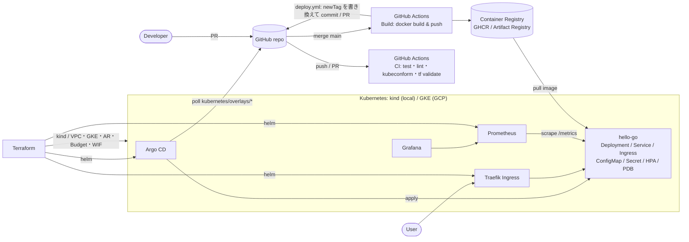

# Architecture

## 全体像



## 層ごとの責務

| 層 | 技術 | 何を管理するか | 管理場所 | 反映方法 |
|---|---|---|---|---|
| Application（20%） | Go / FastAPI | ビジネスロジック | `apps/` | Build → Registry |
| Container | Docker | 実行環境の固定 | `apps/*/Dockerfile` | Build |
| Workload | Kubernetes + Kustomize | 何を・いくつ・どの設定で動かすか | `kubernetes/` | Argo CD（GitOps） |
| Delivery | GitHub Actions / Argo CD | いつ・どう反映するか | `.github/workflows/`, `argocd/` | Git |
| Platform add-ons | Helm via Terraform | Ingress / GitOps / 監視の土台 | `terraform/modules/platform-addons` | terraform apply |
| Infrastructure | Terraform | クラスタ・ネットワーク・IAM・予算 | `terraform/` | terraform apply |
| Observability | Prometheus / Grafana | 状態の可視化・アラート | `monitoring/`, `components/monitoring` | Terraform + Argo CD |

**「誰が何を適用するか」を分けている** のがポイント：
- インフラとアドオン（変更頻度：低）→ 人が `terraform plan/apply`
- ワークロード（変更頻度：高）→ Argo CD が Git から自動適用
- イメージ → CI が Registry に push、タグの書き換えだけを Git にコミット

## 環境

| 環境 | クラスタ | Namespace | 反映 | URL |
|---|---|---|---|---|
| local | kind | `mcp-local` | `kubectl apply -k`（手動・Phase 3 用） | http://hello-local.localtest.me |
| dev | kind → GKE | `mcp-dev` | Argo CD 自動 Sync | http://hello-dev.localtest.me |
| staging | kind → GKE | `mcp-staging` | PR → 自動 Sync | http://hello-staging.localtest.me |
| prod | kind（学習）/ GKE | `mcp-prod` | PR → **手動 Sync** | http://hello.localtest.me |

> 学習用に 1 つのクラスタに 3 環境を Namespace で同居させている。実務では prod は別クラスタ・別プロジェクトにするのが一般的（ADR 0003）。

## Kustomize の構造

```text
kubernetes/
├── base/                 全環境共通（Deployment / Service / Ingress / ConfigMap 既定値）
├── components/           ON/OFF できる部品（hpa / monitoring / pdb / network-policy / postgres）
├── overlays/<env>/       環境差分（namespace / image tag / replicas / resources / config.env / secret.env）
└── jobs/                 GitOps 管理外の実験用（loadgen / smoke）
```

適用順: base → components → overlay の patches。**overlay の patch が最後に勝つ**（T06 の replicas の罠の原因）。

## リクエストの流れ（local）

```text
curl http://hello-dev.localtest.me
 → DNS: *.localtest.me = 127.0.0.1
 → ホストの :80 → kind control-plane コンテナの :30080（extraPortMappings）
 → Traefik Service (NodePort 30080) → Traefik Pod
 → Ingress ルール（host: hello-dev.localtest.me）→ Service hello-go:80 (mcp-dev)
 → EndpointSlice → Pod IP:8080 → hello-go プロセス
```

GKE では「ホスト :80 → NodePort」の部分が「Cloud Load Balancer → Traefik Service (LoadBalancer)」に変わるだけで、それ以降は同じ。

## セキュリティの既定値

| 項目 | 実装 |
|---|---|
| コンテナ | distroless / non-root / readOnlyRootFilesystem / capabilities drop ALL / seccomp RuntimeDefault |
| CI → GCP | Workload Identity Federation（鍵ファイルなし）、リポジトリ名で attribute_condition |
| GKE ノード | 専用 SA（最小ロール）、Workload Identity、（任意）Private ノード |
| ネットワーク | Firewall は内部 + IAP のみ、NetworkPolicy（Dataplane V2） |
| 管理画面 | GKE では Ingress 公開しない（port-forward） |
| GitOps | AppProject で repo / namespace を制限、prod は手動 Sync |
| Secret | 学習用に Git に dummy。本番方針は ADR 0006 |
